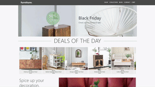

# [FSI ThumbBar](https://www.neptunelabs.com) &middot; Samples
| ***Pixel-perfect*** | ***High-DPI-ready*** | ***Fast :rocket:*** | ***Hackable*** | ***Consistent*** |
|:-----------------:|:-------------:|:---------------:|:---------------:|:---------------:|

[][License]


FSI ThumbBar is a Javascript based image thumb bar with optional image zoom.
It uses the real-time scaling capabilities of the image server to achieve pixel-perfect results.
FSI ThumbBar can be created and controlled as a simple HTML tag and/or via the JavaScript API.

This repository contains examples of how to use and build your own applications.



## Getting Started

Without starting this project in your IDE, you can discover all the
demos on the [Github Pages][GHPages] or develop and customise in [Stackblitz][Stackblitz].

## Start and develop

To run and modify this samples:

#### NPM

```shell
npm install
npm start
```
or

#### Yarn

```shell
yarn
yarn start
```

Now you can customize the demo according to your own preferences or develop something new.

You can find a very simple example to start with in the ``samples/starter`` folder.

## How it works

These examples rely on a framework that uses [Grunt][Grunt], [Browsersync][Browsersync],
[Bootstrap][Bootstrap] and Sass to launch a local server,
replace template variables and pass changes directly to the browser window.

However, these dependencies are generally **not required** for the use of FSI Server!

## Requirements

To run the demo you do not need your own image server.
If you don't have your own server but still want to use your own images,
you can use an [evaluation copy][Server] indefinitely.
In case of an own server, please copy ``env.yml.dist`` to ``env.yml`` and
change the settings.


## Documentation
For further information on the FSI Viewer and FSI Server,
please refer to the official [documentation][Docs].

[License]: https://github.com/neptunelabs/fsi-thumbbar-samples/blob/main/LICENSE
[Docs]: https://docs.neptunelabs.com/fsi-viewer/latest/fsi-thumbbar
[Server]: https://www.neptunelabs.com/get/
[Grunt]: https://gruntjs.com/
[Browsersync]: https://browsersync.io/
[Bootstrap]: https://getbootstrap.com/
[GHPages]: https://neptunelabs.github.io/fsi-thumbbar-samples/
[Stackblitz]: https://stackblitz.com/edit/fsi-thumbbar-samples
