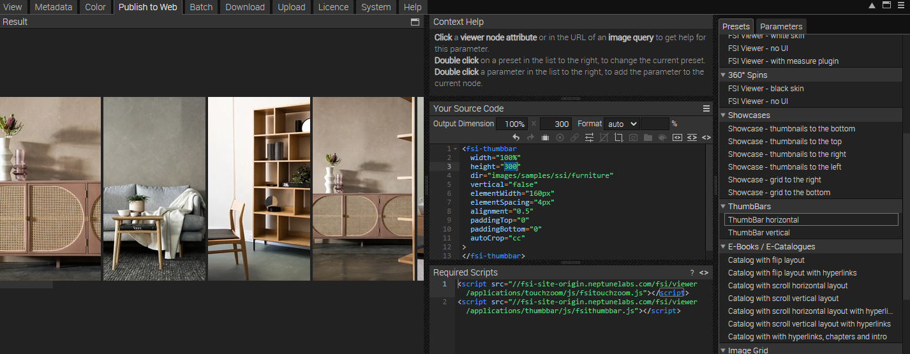
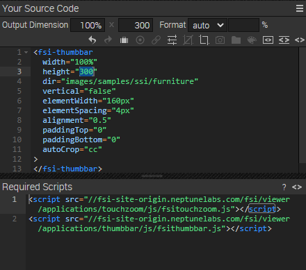
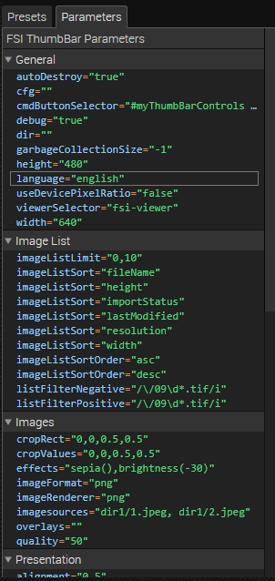
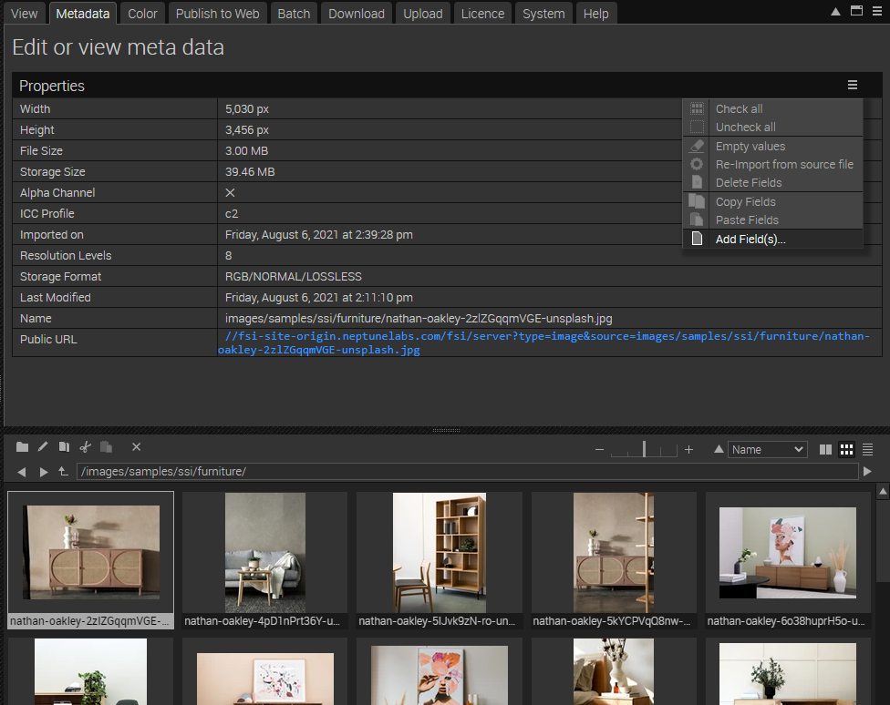
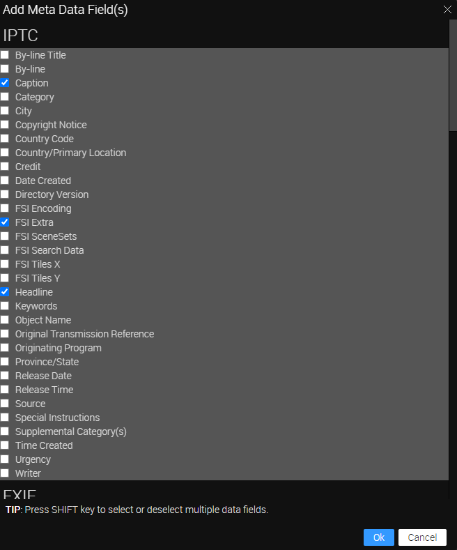
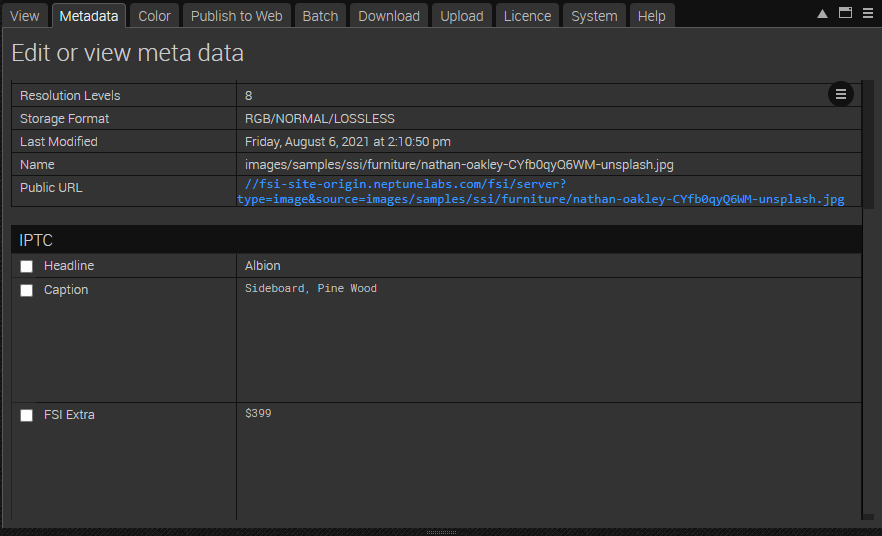

# Frontpage - Using FSI ThumbBar for featured products

This readme describes how the front page sample with *FSI ThumbBar* of *FSI Server* is achieved.
The aim of the demo is to show how you can easily integrate the viewer.
You will also learn how to add metadata to images.

# Add your images/ assets to FSI Server

First, you'll need to upload the images you want to use to FSI Server.
You can install a [demo version](https://www.neptunelabs.com/get/) via Docker or use our [online demo server](https://demo.fsi-server.com/fsi/interface/) to try it out first.

# Uploading images

There are several possibilities to upload images into the interface.


- Choose the Upload tab, click the "Choose files" button to add files to upload to the list. The files will be uploaded to the current folder.
- Drag & Drop files to the file view or the tree view

While having an image or folder selected, you can see all possible publishing ways for the specific item by visiting the "Publish To Web" tab.
For this example, select one image and use the preset *ThumbBar horizontal* in the section *ThumbBars* :



This publishes the directory with a custom <fsi-thumbbar> tag and displays a horizontal thumbnail bar.




The *Source Code* section enables you to control the look of your viewer by setting the dimensions and format, as well as adding effects or crop options to it.

You can set the output dimensions and format (auto automatically chooses the best format for the browser used, or you can set WEBP, JPEG, PNG or GIF).
In this area you also can see the source code for your selected publishing option which you can edit and copy to publish the images.

Here you also see the <fsi-thumbbar> tag which sets the parameters used for the zoom option.
If you click on the tag, the bar on the right automatically switches to the tab *Parameters*, enabling you to customize the ThumbBar to your liking.



For all parameters which can be used, please consult the [manual](https://docs.neptunelabs.com/fsi-viewer/latest/fsi-thumbbar).


# Using FSI ThumbBar

In order to display all images with TouchZoom, you only need to add the corresponding script
to the head of your website:

```html
<script
  src='https://fsi-site.neptunelabs.com/fsi/viewer/applications/thumbbar/js/fsithumbbar.js'
</script>
```
This ensures that FSI ThumbBar is loaded.

Simply embed an FSI ThumbBar tag on the page where you want to display the thumb bar.
In our example, this looks like this:

```html
    <fsi-thumbbar
  width="100%"
  height="300px"
  imagesources="images/samples/ssi/furniture/nathan-oakley-boFO5uIUKUU-unsplash.jpg, images/samples/ssi/furniture/nathan-oakley-CYfb0qyQ6WM-unsplash.jpg, 	images/samples/ssi/furniture/nathan-oakley-kfIN3cGA5xE-unsplash.jpg, 	images/samples/ssi/furniture/nathan-oakley-OngbrOmqtzc-unsplash.jpg, 	images/samples/ssi/furniture/nathan-oakley-ReWaWXpLnP8-unsplash.jpg, images/samples/ssi/furniture/nathan-oakley-S_jZAOH1Zwg-unsplash.jpg"
  vertical="false"
  elementWidth="250px"
  elementSpacing="6px"
  alignment="0.5"
  paddingTop="0"
  paddingBottom="0"
  autoCrop="cc"
  scrollBar="false"
  id="fsi-thumbs"
  thumbLabel="###iptc.Headline### <br/>###iptc.Caption### <br/>###iptc.FSI Extra###"
  enableZoom="false"
>
</fsi-thumbbar>
```
## Adding Metadata to images

In our example we have displayed some labels beneath the thumb bar.
This is achieved by adding the following parameter: **thumbLabel="###iptc.Headline### <br/>###iptc.Caption### <br/>###iptc.FSI Extra###"**

In order to add metadata, go to the tab *Metadata* and click on the three tiles on the right, selecting **Add fields**:



Tip: if you do this with multiple images selected, the fields will be added to them, making it more convenient.

We have added Headlines, Caption and FSI Extra to it:



You can then type in all the information you want to display in the fields:



## Adding Scroll Buttons

If you want to add control buttons to the FSI ThumbBar instance (e.g. like in this example to scroll through the available images), you can do this by
using the cmdButtonSelector parameter and corresponding HTML attributes.

In order to set buttons around the FSI ThumbBar element, we create a div with the class fsi-showcase-buttons between the fsi-viewer and the fsi-thumbbar element:

```html
<div class="fsi-showcase-buttons w-100 mx-auto">
        <div class="fsi-showcase-buttons-inner" id="myThumbBarControls">
          <input class="prev" type="button" x-fsi-cmd="previousImage" />
          <input class="next"  type="button" x-fsi-cmd="nextImage"/>
        </div>
      </div>
```

The inner div with the class fsi-showcase-buttons-inner receives the ID myThumbBarControls. This ID needs to be referred to in the tag in the following way:

*cmdButtonSelector="#myThumbBarControls > input"*

The input elements need to be provided with the corresponding FSI commands in order to function properly. In this case, we have added

*x-fsi-cmd="previousImage"*
to the left button and

*x-fsi-cmd="nextImage"*
to the right button.

## Testing with examples from your own server

To test the examples with images from your own [FSI Server](https://www.neptunelabs.com/fsi-server/), please first copy the env.yml.dist file to env.yml and adapt the file, then restart the main demo again.
