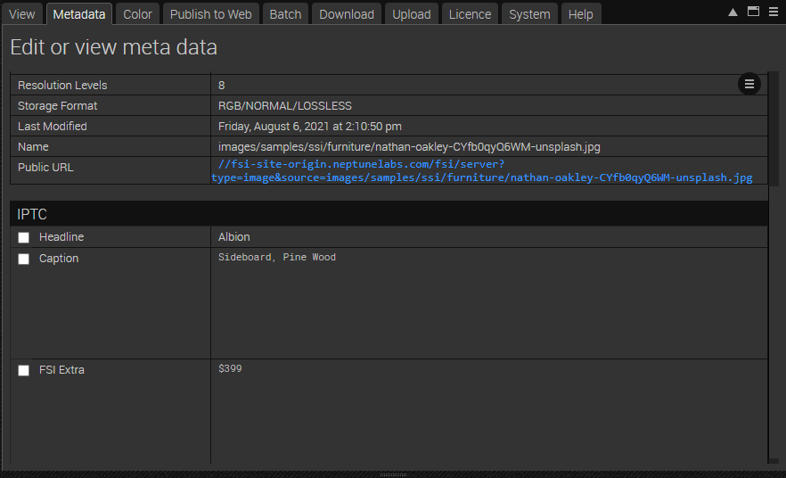

# Frontpage - Using FSI ThumbBar for featured products

This readme describes how to achieve the front page example with _FSI ThumbBar_ from _FSI Server_.
The aim of the demo is to show you how to easily integrate the viewer.
You will also learn how to add metadata to images.

# Using FSI ThumbBar

To display the images as a thumbnail, all you need to do is add the script
at the top of your page:

```html
<script
  src='https://docs.neptunelabs.com/fsi/viewer/applications/thumbbar/js/fsithumbbar.js'
</script>
```

This will ensure that FSI ThumbBar is loaded.

Simply embed an FSI ThumbBar tag in the page where you want the thumb bar to appear.
In our example it looks like this:

```html
<fsi-thumbbar
  width="100%"
  height="300px"
  imagesources="images/samples/ssi/furniture/nathan-oakley-boFO5uIUKUU-unsplash.jpg, images/samples/ssi/furniture/nathan-oakley-CYfb0qyQ6WM-unsplash.jpg, 	images/samples/ssi/furniture/nathan-oakley-kfIN3cGA5xE-unsplash.jpg, 	images/samples/ssi/furniture/nathan-oakley-OngbrOmqtzc-unsplash.jpg, 	images/samples/ssi/furniture/nathan-oakley-ReWaWXpLnP8-unsplash.jpg, images/samples/ssi/furniture/nathan-oakley-S_jZAOH1Zwg-unsplash.jpg"
  vertical="false"
  elementWidth="250px"
  elementSpacing="6px"
  alignment="0.5"
  paddingTop="0"
  paddingBottom="0"
  autoCrop="cc"
  scrollBar="false"
  id="fsi-thumbs"
  thumbLabel="###iptc.Headline### <br/>###iptc.Caption### <br/>###iptc.FSI Extra###"
  enableZoom="false"
>
</fsi-thumbbar>
```

## Adding Meta Data to images

In our example we have displayed some labels beneath the thumb bar.
This is achieved by adding the following parameter: **thumbLabel="###iptc.Headline### <br/>###iptc.Caption### <br/>###iptc.FSI Extra###"**

In order to add metadata, go to the tab _Metadata_ and click on the three tiles on the right, selecting **Add fields**:


Tip: if you do this with multiple images selected, the fields will be added to them, making it more convenient.

We have added Headlines, Caption and FSI Extra to it:


You can then type in all the information you want to display in the fields:



## Testing with examples from your own server

To test the examples with images from your own [FSI Server](https://www.neptunelabs.com/fsi-server/), please first copy the env.yml.dist file to env.yml and adapt the file, then restart the main demo again.
